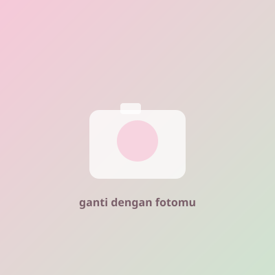

# my kisah — luv raisya

Website personal satu halaman, dibuat dengan HTML, CSS, dan JavaScript murni (tanpa framework), file terpisah supaya gampang diedit.

## Struktur file

```
project/
├── index.html      → semua konten & struktur section
├── style.css       → semua tampilan (warna, font, layout, animasi)
├── script.js       → interaksi (menu mobile, scroll reveal, love meter)
└── images/
    └── placeholder.svg   → gambar sementara, ganti dengan fotomu
```

## Yang perlu kamu ganti

**1. Paragraf pembuka (di bawah judul "Raisya")**
Cari `<div class="hero__intro">` di `index.html`. Ada 3 `<p class="hero__paragraph">` — ganti isinya dengan ceritamu. Boleh tambah atau kurangi paragraf, tinggal duplikasi/hapus baris `<p class="hero__paragraph">...</p>`. Tombol panah di bawahnya sekarang murni tombol scroll (bukan link lagi).

**2. Foto**
Taruh foto asli kamu di folder `images/` (misal `raisya-1.jpg`), lalu di `index.html` cari baris seperti:

```html

```

ganti `src`-nya jadi:

```html

```

Ini berlaku untuk 18 foto di section **Galeri** (`little pieces of us`), dibagi 3 baris. Tiap baris berisi 6 foto asli + 6 foto duplikat (bertanda `aria-hidden="true"`) di dalam satu track yang sama — ini sengaja dibuat begitu supaya animasi infinite scroll-nya mulus tanpa "patah". Kalau kamu ganti foto, ganti juga versi duplikatnya dengan foto yang sama persis di posisi yang sama, biar loop tetap mulus.

**3. Teks di section "Tentang Raisya"**
Section ini sekarang berupa 3 paragraf dalam 3 kolom (bukan foto). Cari `<div class="about-columns">`, lalu di tiap `<div class="about-col">` ganti isi `<p class="about-col__text">...</p>` dengan tulisanmu.

**4. Teks di section "Yang Aku Ketahui dari Raisya"**
Ada 10 `<article class="know-card">`. Setiap kartu punya:
- `know-card__label` → kategori (sudah diisi contoh: hal yang dia suka, kebiasaan kecil, dst — boleh diganti)
- `know-card__text` → isi ceritanya, ganti tulisan "Tulis hal yang membuatku ingat Raisya di sini." dengan cerita aslimu

**5. Tombol & popup di Parameter**
Cari di `index.html`:
```html
<button type="button" class="meter__button" id="meterButton">pencet ini!!</button>
```
Ganti teks tombolnya kalau mau. Popup peringatan yang muncul setelah meter penuh ada di `<div class="love-popup" id="lovePopup">` — ganti isi `love-popup__title` ("warning!!") dan `love-popup__text` ("meter cinta terlalu penuh") sesuka kamu. Simbol hati/bunga yang bertebaran saat 100% bisa diganti di `script.js`, cari array `symbols` di dalam fungsi `spawnLoveBurst()`.

**6. Footer**
Cari `<footer class="footer">` di bagian bawah `index.html`, ganti nama "Eka" kalau perlu.

## Cara menjalankan

Cukup buka `index.html` langsung di browser (double click), atau pakai Live Server kalau kamu pakai VS Code. Tidak perlu instalasi apa pun.

## Catatan teknis singkat

- Warna & font diatur lewat CSS variable di bagian paling atas `style.css` (`:root { ... }`) — ubah di satu tempat, berubah di semua bagian.
- Love meter dimulai dari 30%. Saat tombol "pencet ini!!" ditekan, `animateMeter()` di `script.js` menjalankan animasi cepat (±1.1 detik, dengan easing) sampai 100%. Setelah selesai, `openLovePopup()` menampilkan popup peringatan dan `spawnLoveBurst()` menaburkan simbol hati & bunga di sisi kiri-kanan layar, lalu otomatis membersihkan diri setelah animasinya selesai. Popup bisa ditutup lewat tombol "tutup", klik di luar kotak, atau tombol Escape.
- Galeri infinite scroll murni pakai CSS `@keyframes` (`marqueeLeft` / `marqueeRight`) di `style.css`. Baris 1 & 3 ke kiri, baris 2 ke kanan — tidak butuh JavaScript sama sekali, jadi ringan dan tetap jalan otomatis, serta berhenti sejenak (pause) saat foto di-hover.
- Semua card & section punya class `.reveal` yang di-observe lewat `IntersectionObserver` di `script.js` untuk efek fade-in saat masuk viewport.
